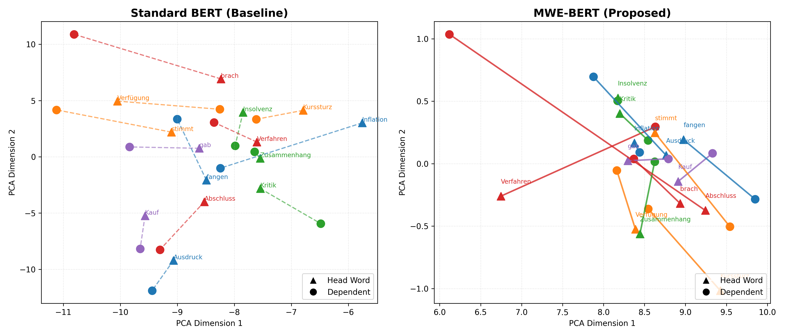

# Bilingual MWE-BERT: Fine-tuning with Head-Based Masking

## Project Overview

This repository contains the algorithm and implementation for the research paper: **"A bilingual study of Multi-Word Expressions in Journalistic Texts: Fine-tune BERT with Head-Based Masking Technique."**

The study introduces a novel **Head-Based Masking Technique** and a **4-Component Embedding Architecture** ($E_{token} + P_{intra} + E_{phrase} + P_{inter}$) to improve the numerical representation of Multi-Word Expressions (MWEs) in German financial and journalistic texts.

The goal is to solve the "Distributed Semantic" problem (e.g., Separable Verbs like *brach... ein*) by forcing the model to treat distant components as a single semantic unit, creating tighter vector clusters for domain-specific terminology.

## Visual Results

The evaluation script generates a PCA projection showing how the custom model "pulls" semantic pairs together compared to standard BERT.

**Figure 1:** PCA projection of financial MWE vector pairs. The left panel shows vector proximity in Standard BERT, while the right panel shows the proposed MWE-BERT. Note the tighter clustering of causal pairs (e.g., *Zuwächsen-eingependelt*) in the proposed model.



## Directory Structure

```
├── MWEProcessor.py          # Pre-processing, Chunking, Attention Masks, Dual Masking
├── MWEBertEmbeddings.py     # Custom Neural Architecture (The 4-Component Sum)
├── main.py                  # Encoder Training (Freeze -> Fine-tune)
├── evaluation.py            # Metric Calculation (Cosine/Euclidean) & Visualization
└── README.md                # Documentation
```

## Installation & Setup

### Environment

- Python 3.8+ (Note: Python 3.11 or 3.12 recommended; 3.14 is currently unsupported)

### Dependencies

```bash
pip install torch transformers spacy datasets scipy numpy matplotlib scikit-learn
```

### Language Model

Download the large German model for spaCy (critical for dependency parsing):

```bash
python -m spacy download de_core_news_lg
```

## How to Run the Experiment

### 1. Training (main.py)

The training script automatically downloads the Europarl (DE-EL) dataset, filters for complex journalistic sentences, and trains the custom German Encoder.

It implements a **Two-Phase Training Strategy** to prevent Catastrophic Forgetting:

- **Phase 1 (Epoch 1):** The Base BERT model is **FROZEN**. Only the new Phrase Embeddings and CLS head are trained. This aligns the new architecture without destroying pre-trained knowledge.
- **Phase 2 (Epoch 2+):** The Base BERT is **UNFROZEN**. The entire model is fine-tuned using differential learning rates (Lower LR for BERT, Higher LR for Phrase Embeddings).

```bash
python main.py
```

**Output:** Saves the encoder weights to `./financial_mwe_bert_output`.

### 2. Evaluation (evaluation.py)

This script loads the saved custom model and compares it against a standard `bert-base-german-cased`. It calculates:

- **Cosine Similarity Improvement:** (Higher is better)
- **Euclidean Distance Reduction:** (Lower is better)

It tests against a curated list of Financial Causality, Separable Verbs, and Fixed Expressions.

```bash
python evaluation.py
```

**Output:** Prints the results table to the console and generates `paper_visualization.png`.

## Evaluation Results

The evaluation script tests the model on a curated test set (defined in `evaluation.py`) containing 14 MWE pairs across four categories: Financial Causality, Functional Verbs, Separable Verbs, and Journalistic Phrasing.

### Results Table

| MWE Pair | Cos Sim (Std) | Cos Sim (MWE) | Improvement |
|----------|---------------|---------------|-------------|
| Inflation - erhöhen | 0.6114 | 0.8851 | +44.78% |
| Kurssturz - verloren | 0.5572 | 0.8728 | +56.64% |
| Insolvenz - anmelden | 0.6467 | 0.9804 | +51.62% |
| Verfahren - einleiten | 0.7293 | 0.7087 | -2.83% |
| Kauf - nehmen | 0.6117 | 0.9570 | +56.45% |
| Ausdruck - bringen | 0.6636 | 0.8984 | +35.38% |
| Verfügung - stellte | 0.6355 | 0.8647 | +36.07% |
| Kritik - üben | 0.6184 | 0.9592 | +55.12% |
| brach - ein | 0.5022 | 0.8624 | +71.73% |
| gab - bekannt | 0.6260 | 0.9150 | +46.17% |
| fangen - an | 0.4098 | 0.9417 | +129.81% |
| stimmt - ab | 0.4095 | 0.9372 | +128.86% |
| Zusammenhang - steht | 0.6405 | 0.8833 | +37.92% |
| Abschluss - bringen | 0.5972 | 0.8251 | +38.15% |
| **AVERAGE IMPROVEMENT** | | | **+56.13%** |

### Key Findings

- The MWE-BERT model achieves a significant **average improvement of +56.13%** in cosine similarity compared to standard BERT.
- **Separable Verbs** show massive gains due to the Head-Based Masking technique connecting distant words. Notably, *fangen - an* improved by **+129.81%** and *stimmt - ab* by **+128.86%**.
- **Financial Terminology** also benefited greatly, with the fixed expression *Insolvenz - anmelden* (File for Bankruptcy) improving by **+51.62%**, validating the model's domain adaptation capabilities.

## Technical Architecture Details

### MWEProcessor.py

- **Robust Chunking:** Identifies Noun Chunks via spaCy and treats remaining verbs/prepositions as single-token phrases to ensure 100% sentence coverage.
- **Attention Masks:** Generates masks to ensure BERT ignores the padding tokens used to enforce the fixed phrase window (10 tokens).
- **Dual Masking:** Implements the core hypothesis by masking the Governor and Dependent simultaneously (e.g., masking both "Inflation" and "erhöhen").

### MWEBertEmbeddings.py

- **Custom Forward Pass:** Overrides standard BERT embeddings.
- **Initialization:** Uses `nn.init.normal_` with a low standard deviation (0.01) for new embeddings to reduce initialization noise.
- **Safe Resizing:** Includes logic to resize the embedding matrix dynamically to accommodate special tokens (`[PHRASE_START]`, `[PHRASE_END]`).

### main.py

- **Differential Optimization:** Uses AdamW with parameter groups to apply aggressive learning rates (1e-3) to new layers and conservative rates (2e-5) to pre-trained layers.
- **Freezing Strategy:** Freezes the base BERT model during the first epoch to allow the new embedding structures to converge before fine-tuning the semantic weights.
